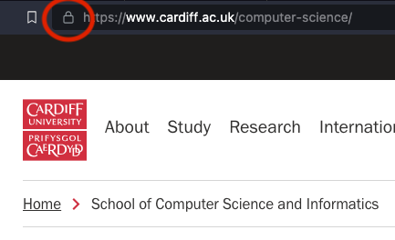

<!-- This page is intentionally blank -->

---
# Aaron Wilson

##### Teaching experience

- Mentoring and development colleagues
- Problem classes and tutorials during my Ph.D

##### Topics / Modules

- Information / Computer Security
- Cryptography
- Programing and software development

---
## A distraction

You are in Wales. 

A bookworm eats from the first page of volume 1 to the last page of volume 3 in a 3-volume encyclopedia, which are stacked on the library shelves. Each volume is 3 centimeters wide.

How many centimeters has the bookworm eaten through ? More importantly, *why* is this the answer ?

---
# Cryptographic Key Exchange

* Understand why we would want a key exchange mechanism
* Understand how the Diffie Hellman mechanism works
* Understand why the Diffie Hellman mechanism is secure

---
# Symmetric Cryptography

---
# Symmetric Cryptography

---
# Symmetric Cryptography

---
# Symmetric Cryptography

---
# Symmetric Cryptography

---
# Symmetric Cryptography

--- 
# Transport Layer Security

--- 
# What properties should a mechanism have ?

* Not rely on previously shared *secret* information
* Agreement 
* Possibly also: authentication
* Computationally efficient

--- 
# Diffie Hellman Key Exchange

* Based on a concept of [Ralph Merkle](https://en.wikipedia.org/wiki/Ralph_Merkle)
* First published in 1976 by [Whitfield Diffie](https://en.wikipedia.org/wiki/Whitfield_Diffie) and [Martin Hellman](https://en.wikipedia.org/wiki/Martin_Hellman)
* One of the first public key protocols 
* Non-authenticated key agreement protocol

--- 
# In action (simple)

<video controls>
<source src="animation/media/videos/colour_shape_maths/480p15/DiffieHellmanKeyExchange.mp4" type="video/mp4" />
</video>

--- 
# How does it work

* Factorisation is computationally hard 
  * $23 * 97 = ?$
  * Factor $4321$ 
  * Quantum computers
* Or equivalently the Discrete Logathrim problem is hard

<!--
For reference:
$ 23 * 97 = 2231$
$ 4321  = 29 * 149$
-->

--- 
# Algorthim (Simplest form, slide 1 of 2)

- Agree on a public prime $p$ as a modulus, and a primitive root to use as a base $g$
  * e.g let's pick $p = 23$, and $g=5$
- The first person picks a secret $a$ and calculates $g^a \mod p$
  * Let's have $a=4$ so that $g^a=5^4=625= 23 * 27 + 4 = 4\mod 23$
- The second person picks a secret $b$ and calculates $g^b \mod p$
  * Let's have $b=3$ so that $g^b=5^3=125= 23 * 5 + 10 = 10\mod 23$

--- 
# Algorithm (Simplest form, slide 2 of 2)

- The parties exchange their values
- The first person now calculates the key, $g^{ab}=(g^b)^a \mod p$
  - That is the first party gets $10$, so calculates $10^4 = 10000 = 23 * 434 + 11 = 18 \mod 23$
- The second person now calculates the key, $g^{ab}=(g^a)^b \mod p$
  - That is the second party receives $4$, so calculates $4^3 = 64 = 2 + 18 \mod 23 = 18 \mod 24$

--- 
# Public Information

* The modulus $p$ and primitive root $g$ (in our example $23$ and $5$)
* The transmitted values between Alice and Bob -  $g^a$ and $g^b$ (in our example $4$ and $10$)
* Thus we can work out $g^{a+b}$, $g^{a-b}$ 
* **BUT NOT** $g^{ab}$

--- 
# In action 

<video controls>
<source src="animation/media/videos/colour_shape_maths/480p15/DiffieHellmanKeyExchangeText.mp4" type="video/mp4" />
</video>

--- 
# Security Properties

* Solve the discrete logarithm problem
* person-in-the-middle-attacks
* [Logjam](https://weakdh.org/)
   * first made public 2015-05-20

---
# Exercises / things to discuss

* Go though the example in the text above, and confirm it works
* Come up with other examples, and then try to break them
* person-in-the-middle attack: how does this work ?
* Could this work with more than two people involved ?

<!--  Bonus points: come up with colours that are correctly additive (!!) -->

---
# Thank you !

Source code and slides are at [https://github.com/optimism-marjoram/diffie_hellman](https://github.com/optimism-marjoram/diffie_hellman)

Contact me [cardiff@noraa.uk](mailto:cardiff@noraa.uk)

